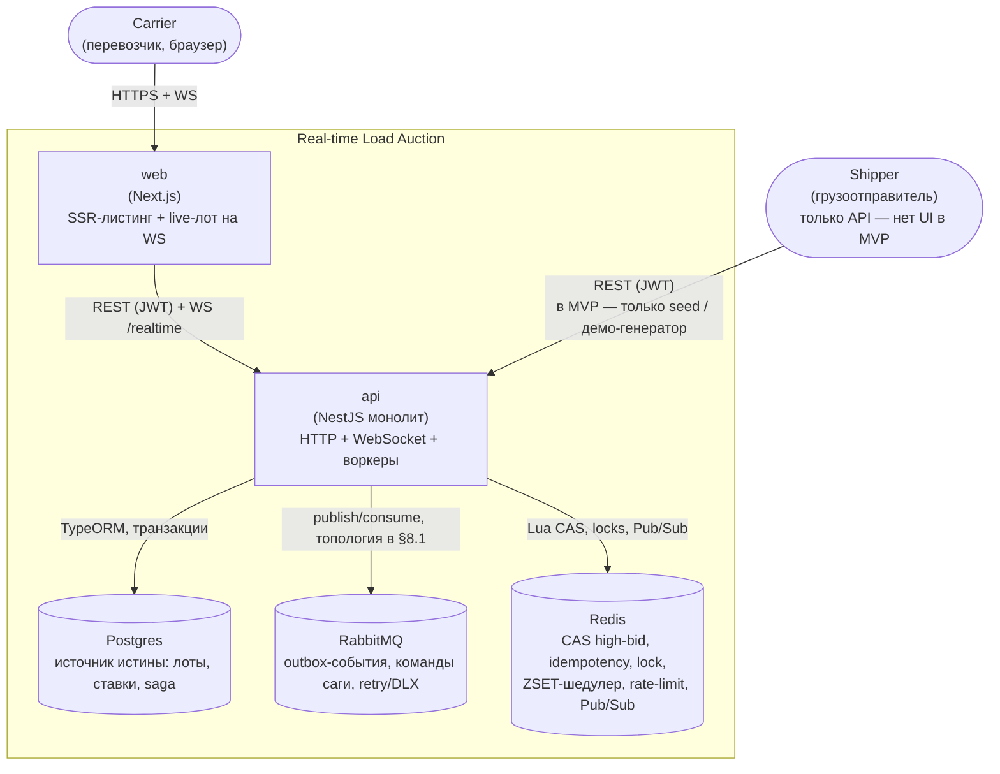

# C4 — контекст и контейнеры

Уровень 1–2: кто пользуется системой и из каких контейнеров она состоит. `api` — единый процесс NestJS (HTTP + WebSocket + фоновые воркеры: outbox relay, scheduler ticker, RMQ-консьюмеры) — модульный монолит, не микросервисы.

