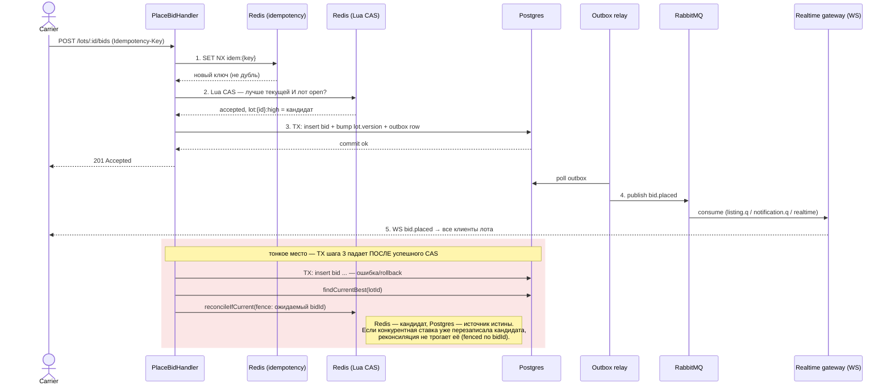

# Горячий путь ставки

§6 ТЗ, реализация — [`place-bid.handler.ts`](../../apps/api/src/modules/bidding/application/place-bid.handler.ts). Happy path — 5 шагов; отдельно показано «тонкое место» — что происходит, если транзакция шага 3 падает уже после успешного Redis CAS на шаге 2.

