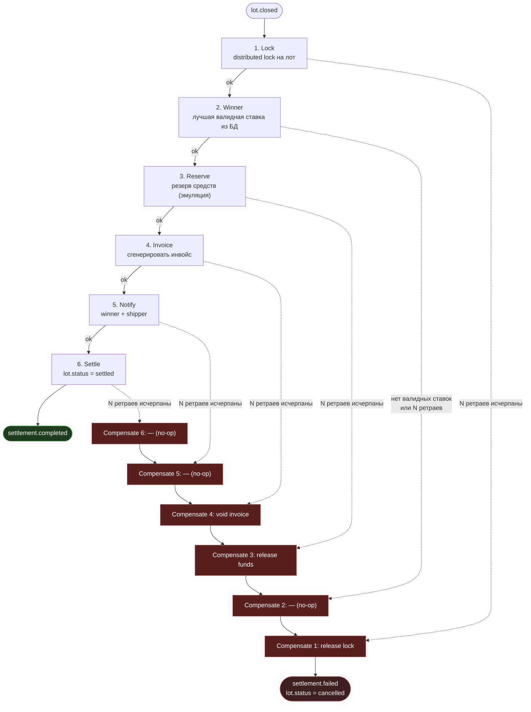

# Saga закрытия лота и сеттлмента

§7 ТЗ. Триггер — событие `lot.closed`. Оркестратор — [`settlement-step.consumer.ts`](../../apps/api/src/modules/settlement/application/settlement-step.consumer.ts), состояние шага/направления — [`saga.ts`](../../apps/api/src/modules/settlement/domain/saga.ts) (`STEP_ORDER`, `nextStep`/`previousStep`), персистится в `saga_instances`. Падение шага после N ретраев переключает саму сагу в `compensating` и запускает компенсацию **начиная с упавшего шага**, затем шаг за шагом назад до `lock`; `winner`/`notify`/`settle` компенсации не имеют (no-op — совпадает с §7, где для них стоит «—»).

